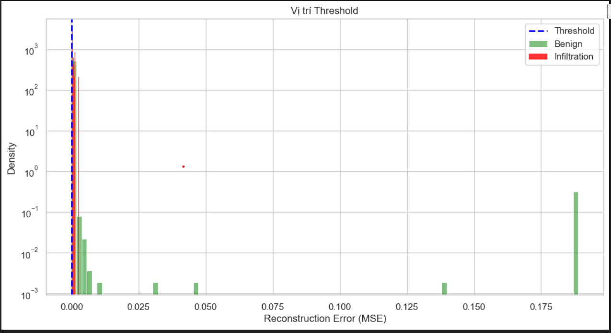
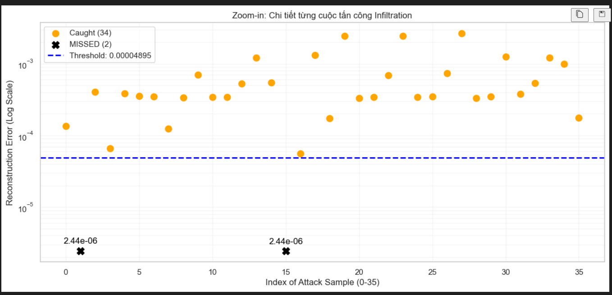

# ANOMALY DETECTION

Dự án này ứng dụng mô hình học sâu Autoencoder để phát hiện các hành vi bất thường trong hệ thống, từ đó dự báo nguy cơ rò rỉ dữ liệu (Data Breach). Bằng cách học cách tái tạo (reconstruct) các dữ liệu bình thường, mô hình có thể xác định các điểm dữ liệu lạ (anomalies) dựa trên sai số tái tạo cao.

📌 Tổng quan dự án
- Rò rỉ dữ liệu thường bắt đầu từ những truy cập bất thường hoặc lưu lượng mạng không xác định. Dự án này tập trung vào:
- Phân tích hành vi người dùng/hệ thống qua các đặc trưng (features).
- Sử dụng kiến trúc mạng thần kinh không giám sát (Unsupervised Learning).
- Thiết lập ngưỡng (threshold) để cảnh báo sớm các dấu hiệu xâm nhập.
- Sử dụng bộ dữ liệu từ CICIDS2017

🏗 Kiến trúc mô hình
- Mô hình Autoencoder bao gồm hai phần chính:
- Encoder: Nén dữ liệu đầu vào thành một biểu diễn không gian thấp chiều (Latent Space).
- Decoder: Khôi phục dữ liệu ban đầu từ không gian nén đó.
- Khi dữ liệu "bất thường" đi qua mạng đã được huấn luyện với dữ liệu "bình thường", khả năng tái tạo của Decoder sẽ kém đi, dẫn đến Reconstruction Error lớn — đây chính là tín hiệu để phát hiện rò rỉ.

🚀 Công nghệ sử dụng
- Ngôn ngữ: Python
- Thư viện AI/ML: TensorFlow/Keras
- Xử lý dữ liệu: Pandas, Numpy
- Trực quan hóa: Matplotlib, Seaborn

🛠 Cài đặt và Sử dụng
### Clone repository:
- git clone https://github.com/Quanggatay2005/anomaly_detection.git
- cd anomaly_detection
### Cài đặt môi trường:
- pip install -r requirements.txt
- Tải bộ dữ liệu và đưa 2 file thứ Hai và thứ năm vào cùng 1 folder: https://cicresearch.ca/CICDataset/CIC-IDS-2017/browse.php?p=CIC-IDS-2017%2FCSVs

### Chạy mô hình: 
- chạy file main.ipynb

📊 Kết quả đối với mức threshold > 94%
- ✅ Tấn công phát hiện đúng (TP): 34/36
- ❌ Tấn công bỏ sót (FN)       : 2
- ⚠️ Báo động giả (FP)          : 17270 (Số lượng Benign bị bắt nhầm)
------------------------------
- Recall    : 0.9444
- Precision : 0.0020
- F1-Score  : 0.0039

Biểu đồ phân phối sai số tái tạo cho thấy sự khác biệt rõ rệt giữa dữ liệu bình thường và dữ liệu có nguy cơ rò rỉ.

### Một số hình ảnh

### Bản demo có dashboard (to be updated): 
- Thực hiện demo một cuộc rò rỉ mạng giữa hai máy victim và attacker. Máy victim sử dụng hệ điều hành windows, máy attacker được chạy trên oracle virtualbox (kali linux). Chi tiết hơn về báo cáo xin liên hệ mquang1305@gmail.com
- https://drive.google.com/file/d/1JVXpbGi9GgqJyCP3GEMmjvn1vMRbDjXJ/view?usp=sharing
